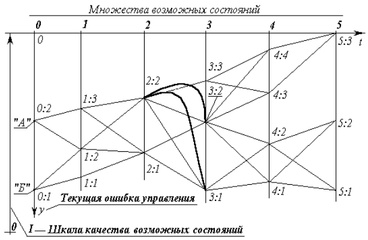

# Достаточно общая теория управления

## Аннотация
Понятийный и терминологический аппарат [достаточно общей теории управления](Книги/dotu_a4_20110626.pdf) — средство междисциплинарного общения специалистов разных частных отраслей знания и деятельности; средство объединения разрозненных научных знаний и прикладных навыков в гармоничную целостность. В современном мире каждый человек сталкивается с гигантским потоком информации, невольно становясь объектом навязанных стереотипов поведения. Достаточно общая теория управления учит правильно анализировать общественные процессы для безопасной жизни и деятельности отдельных людей и коллективов, слагающих общество.

## Для кого предназначен курс
[Курс](Рабочая_программа_курса_ДОТУ.pdf) рассчитан на 1 год обучения — всего 24 занятия длительностью по 1 часу. Курс рекомендован учащимся старших классов средней школы, студентам и заинтересованным вопросами управления лицам. Для успешного изучения данного курса требуется знание обучающимися следующего фундаментального теоретического материала в пределах средней школы:
* русский язык
* математика

## Структура курса
Структура изучаемого курса состоит из следующих тем:
1. Достаточно общая теория управления: зачем это надо?
2. Категории достаточно общей теории управления
3. Устойчивость в смысле предсказуемости
4. Прогностика, пророчества и осуществление единственного варианта будущего
5. Управление: качество и оптимальность
6. Замкнутые системы
7. Способы управления: структурный, в суперсистемах — безструктурный и на основе виртуальных структур
8. Устойчивость управления
9. Схемы управления
10. Полная функция управления, интеллект (индивидуальный и соборный)
11. Манёвры и балансировочные режимы, принципы сопоставления и выявления подобия
12. Манёвры и теория катастроф
13. Процессы в суперсистемах: возможности течения
* Понятие о суперсистемах
* Освоение потенциала развития
* Автосинхронизация процессов в суперсистемах
* Соборный интеллект в суперсистемах
* Внутренние конфликты управления в суперсистеме
* Принцип дополнительности информации и концептуально неопределённое управление как особый вид конфликта управлений
* Восстановление управления суперсистемой как единым целым
* Взаимно вложенные суперсистемы с виртуальной структурой
14. Метод динамического программирования как алгоритмическое выражение достаточно общей теории управления
15. Вхождение в управление

## Содержание курса
### Достаточно общая теория управления: зачем это надо?
Все частные отрасли прикладной науки развили свой понятийный и терминологический аппарат. Фактически во всех прикладных отраслях речь идёт об управлении процессами, относящимися к их «предметной области», но подчас одно и то же слово в одной отрасли означает одно, а в другой — нечто совсем иное. В результате, если специалисты нескольких отраслей собираются вместе для того, чтобы решить некоторую общую для них проблему, то прежде, чем начать её решать, им требуется выработать некий общий профессиональный слэнг. Единообразное описание разнородных процессов с привлечением достаточно общей теории управления позволяет стоять на фундаменте всех частных наук.

### Категории достаточно общей теории управления
Вектор целей. Вектор состояния. Вектор ошибки управления. Полная функция управления. Совокупность концепций управления (целевых функций управления). Вектор управляющего воздействия. Структурный способ управления в русле иерархически наивысшего всеобъемлющего управления на основе виртуальных структур. Бесструктурный способ управления в русле иерархически наивысшего всеобъемлющего управления на основе виртуальных структур. Балансировочный режим (либо манёвр).

### Устойчивость в смысле предсказуемости
Ключевым понятием теории управления является понятие: устойчивость объекта в смысле предсказуемости поведения в определённой мере под воздействием внешней среды, внутренних изменений и управления.

### Прогностика, пророчества и осуществление единственного варианта будущего
В основе устойчивой предсказуемости лежит чувство общевселенской меры, из которого сознание при помощи интеллекта черпает осознанное знание причинно-следственных связей в системе «объект управления — окружающая его среда — система (субъект) управления — средства (органы) управления». Чувство меры — личностно своеобразное чувство. Одна из сторон чувства меры — восприятие и сопоставление вероятностных предопределённостей различных вариантов будущего и их оценок.

### Управление: качество и оптимальность
Управление для субъекта управленца в принципе возможно только объективно существующими процессами (объектами), устойчивыми в смысле предсказуемости для субъекта-управленца. Если в отношении объективности и предсказуемости возникнут иллюзии, то они вызовут со временем вполне реальное разочарование. Характеристики реального управления всегда отличаются от идеальных, предписанных вектором целей управления. «Разность» вектора целей и вектора текущего состояния объекта даёт вектор ошибки управления.

### Замкнутые системы
«Замкнутая система» это — объект управления (процесс), находящийся во взаимодействии со средой, и система управления им, связанные друг с другом цепями прямых и обратных связей.

### Способы управления: структурный, в суперсистемах — безструктурный и на основе виртуальных структур
В процессе управления замкнутая система и её часть — система управления — образуют структуру, подчинённую вектору целей и несущую концепцию управления и составляющие её целевые функции. Качество управления обеспечивается при этом двумя факторами:
* архитектурой структуры, то есть функциональной нагрузкой её элементов (включая каналы информационного обмена) и упорядоченностью (организацией, иерархией) элементов в структуре;
* характеристиками работоспособности, функциональной пригодностью самих элементов, входящих в структуру, для осуществления возлагаемых на них функций (своего рода «квалификационным» уровнем элементов).
           
### Устойчивость управления
Область изменения параметров среды и замкнутой системы, в которой замкнутая система устойчива в смысле предсказуемости поведения, — область потенциально устойчивого управления. Выход из неё ведёт к потере управления по непредсказуемости поведения.
           
### Схемы управления
Программное управление. Программно-адаптивное управление. Управление по схеме предиктор-корректор.

### Полная функция управления, интеллект (индивидуальный и соборный)
Полная функция управления:
1. Выявление фактора среды, который вызывает потребность в управлении
2. Формирование навыка распознавания фактора среды
3. Целеполагание в отношении выявленного фактора
4. Формирование генеральной концепции управления и частных концепций управления в отношении каждой из целей в составе вектора целей
5. Внедрение генеральной концепции управления в жизнь
6. Контроль за деятельностью структур в процессе управления
7. Совершенствование действующей концепции в случае необходимости
8. Ликвидация существующих структур и высвобождение используемых ресурсов в случае ненадобности либо поддержание их в работоспособном состоянии до следующего использования

Интеллект — самоизменяющийся, самонастраивающийся алгоритм выбора, преобразования информации, в результате действия которого возникают информационные модули, ранее данному субъекту не известные и в готовом виде в него извне не поступавшие.

### Манёвры и балансировочные режимы, принципы сопоставления и выявления подобия
Устойчиво управляемая система может находиться либо в балансировочном режиме, либо в режиме манёвра. Один и тот же, реально протекающий режим может быть интерпретирован и как балансировочный, если соотноситься с одним вектором целей, и как режим манёвра, если соотноситься с другим вектором целей.
Анализ течения подобного моделирующего процесса может протекать в более высокочастотном диапазоне, чем течение реального подобного моделируемого процесса: это даёт возможность заглянуть в будущие варианты развития моделируемого процесса, что является основой решения задач управления вообще и задачи о предсказуемости, в частности.

### Манёвры и теория катастроф
Замкнутая система может иметь один и более устойчивых балансировочных режимов. Перевод замкнутой системы из одного балансировочного режима в другой — наиболее часто встречающийся вид манёвра.
Теория катастроф рассматривает процессы, в которых плавное изменение параметров системы прерывается их скачкообразным изменением (предсказуемым или заранее неизвестным), после чего система оказывается в другом режиме существования или разрушается.

### Процессы в суперсистемах: возможности течения
#### Понятие о суперсистемах
Суперсистема — множество элементов, хотя бы частично функционально аналогичных в некотором смысле друг другу.

#### Освоение потенциала развития
Освоение потенциала развития суперсистемы — выведение её на максимум производительности в отношении среды по вектору целей иерархически высшего (объемлющего) управления. Оценки качества управления:
1. Повышение запаса устойчивости пребывания суперсистемы в среде позволяет
2. Поднять её производительность в отношении среды.

#### Автосинхронизация процессов в суперсистемах
Автосинхронизация — явление совпадения фаз идентичных процессов, протекающих на множестве аналогичных объектов одновременно. Автосинхронизация часто проявляется в процессах безструктурного управления, а само безструктурное управление может строится на основе явления автосинхронизации.

#### Соборный интеллект в суперсистемах
Если элементы, образующие суперсистему, сами обладают индивидуальным интеллектом, то при информационном обмене между собой они вероятностно предопределённо порождают соборный интеллект.

#### Внутренние конфликты управления в суперсистеме
Вектора целей накапливают частные цели и устанавливают их приоритеты под давлением своеобразия опыта взаимодействия со средой их носителей. Виды векторов целей: объективные, потенциальные, идентифицированные (выявленный в наблюдениях), автоидентифицированные субъективные. Виды дефектов управления: инверсия приоритетов целей, антагонизмы целей, концептуально неопределённое управление.

#### Принцип дополнительности информации и концептуально неопределённое управление как особый вид конфликта управлений
«Концептуально неопределённое управление» — термин, воспринявший в себя внутреннюю противоречивость этого явления, поскольку действительное управление всегда объективно концептуально определённо:
* в смысле определённости целей и иерархической упорядоченности их по значимости в полном множестве целей и
* в смысле определённости допустимых и недопустимых конкретных средств осуществления каждой из целей управления.

#### Восстановление управления суперсистемой как единым целым
В момент соприкосновения автономных регионов в суперсистеме одновременно может существовать несколько региональных центров управления, каждый из которых несёт полные функции управления общесуперсистемного уровня значимости и, следовательно, в деятельности каждого из них будет объективно прослеживаться тенденция к управлению суперсистемой как единым целым по некой полной функции управления. Две стратегии:
1. Разрушение управления по полной функции в регионах конкурентах и поглощение их обломков.
2. Упреждающее вписывание.

Три типа алгоритмов выработки управляющего воздействия:
1. Алгоритм управления, подчинённого непрестанно меняющимся потребностям сиюминутности.
2. Алгоритм управления, на основе включения потока текущей информации в память системы.
3. Алгоритм управления с защитой памяти системы от накопления недостоверной информации.

#### Взаимно вложенные суперсистемы с виртуальной структурой
Общность в процессе самоуправления элементов информационно-алгоритмической и интеллектуальной базы суперсистемы, в сочетании с господством интеллектуальных схем управления предиктор-корректор на уровне суперсистемы в целом и вложенных в неё иерархических уровнях, делают несущественной мгновенную её структурно-иерархическую упорядоченность, стирают различие между структурным и бесструктурным управлением и процесс видится как взаимная вложенность гибких (виртуальных) структур в общесуперсистемной схеме предиктор-корректор соборного интеллекта.

### Метод динамического программирования как алгоритмическое выражение достаточно общей теории управления
Метод динамического программирования — это алгоритм пошагового достижения целевого состояния системы. Каково бы ни было состояние системы перед очередным шагом, надо выбирать управление на этом шаге так, чтобы выигрыш на данном шаге плюс оптимальный выигрыш на всех последующих шагах был максимальным.
Суть метода динамического программирования изображена на рисунке:

### Вхождение в управление
В большинстве случаев сознание обращается к проблемам управления жизненными обстоятельствами, ситуациями, проблемам самообладания, умения вести себя, столкнувшись с трудностями, неудачами, разочарованием, то есть не в самое комфортное для себя время — большей частью в разнородных «стрессовых» ситуациях.

## Учебно-методический комплекс
1. Внутренний Предиктор СССР — Достаточно общая теория управления. М:
Концептуал, 2018. — 464 с. В формате PDF, листы А4: [dotu_a4_20110626.pdf](Книги/dotu_a4_20110626.pdf), листы А5: [dotu_a5_20110626.pdf](Книги/dotu_a5_20110626.pdf)
2. Рабочая программа очного курса обучения «Достаточно общая теория управления» для старших классов. В формате PDF: [Рабочая_программа_курса_ДОТУ.pdf](Рабочая_программа_курса_ДОТУ.pdf). Исходник в формате ODT: [Рабочая_программа_курса_ДОТУ.odt](Рабочая_программа_курса_ДОТУ.odt)